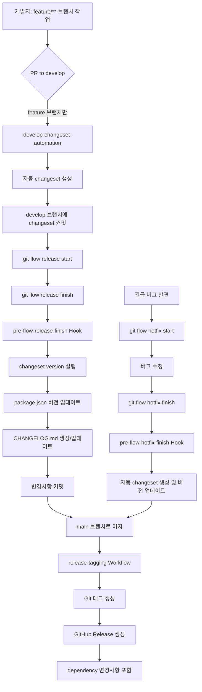

# Changesets 기반 버전 관리 체계 구축

## 목적

이 문서는 Monorepo 환경에서 Changesets를 활용한 자동화된 버전 관리 체계를 구축하는 방법을 설명합니다.

**필요성 및 개선 목적**

- **문제**: Monorepo 환경에서 여러 패키지의 버전을 수동으로 관리하면 누락, 버전 불일치, CHANGELOG 미작성 등의 문제가 발생
- **목적**: Changesets와 Git Flow를 통합하여 버전 관리를 자동화하고 일관된 릴리즈 프로세스 확립
- **개선 효과**:
  - 개발자가 changeset 파일만 작성하면 버전 범프, CHANGELOG 생성, Git 태그, GitHub Release가 자동으로 생성
  - Conventional Commits 기반으로 자동 changeset 생성 지원
  - Git Flow와 통합되어 release/hotfix 브랜치에서 자동 버전 업데이트

---

## 기능 도식화



### 시스템 구성 요소

**Frontend (Monorepo 구조)**
- `packages/`: 공유 패키지 (@repo/ui, @repo/hooks)
- `apps/`: 애플리케이션 (web)
- `.changeset/`: Changeset 파일 저장소

**CI/CD (GitHub Actions)**
- `develop-changeset-automation`: PR 머지 시 자동 changeset 생성
- `release-tagging`: Release/Hotfix 머지 시 태그 및 GitHub Release 생성

**Git Hooks (Husky)**
- `pre-flow-release-finish`: Release 완료 전 자동 버전 업데이트
- `pre-flow-hotfix-finish`: Hotfix 완료 전 자동 버전 업데이트

---

## 세부 설명

### 1. Changesets 기본 설정

**설치 및 초기화**

```bash
# Changesets CLI 설치
pnpm add -Dw @changesets/cli

# Changesets 초기화
pnpm changeset init
```

**설정 파일 (.changeset/config.json)**

```json
{
  "$schema": "https://unpkg.com/@changesets/config@3.1.2/schema.json",
  "changelog": "@changesets/cli/changelog",
  "commit": false,
  "fixed": [],
  "linked": [],
  "access": "public",
  "baseBranch": "main",
  "updateInternalDependencies": "patch",
  "ignore": [],
  "___experimentalUnsafeOptions_WILL_CHANGE_IN_PATCH": {
    "onlyUpdatePeerDependentsWhenOutOfRange": true
  }
}
```

**주요 설정 항목**
- `baseBranch: "main"`: 버전 비교 기준 브랜치
- `commit: false`: 자동 커밋 비활성화 (Git hooks에서 수동 관리)
- `access: "public"`: 패키지 공개 설정
- `updateInternalDependencies: "patch"`: 내부 의존성 업데이트 시 patch 버전 증가

**package.json 스크립트**

```json
{
  "scripts": {
    "changeset": "changeset",
    "version": "changeset version",
    "release": "pnpm build && changeset publish"
  }
}
```

---

### 2. Git Flow 통합 - Release 브랜치

**구현 위치**: `.husky/pre-flow-release-finish`

**동작 흐름**

1. **Changeset 파일 확인**
   - `.changeset/*.md` 파일 존재 여부 확인
   - 없으면 자동 생성 로직 실행

2. **자동 Changeset 생성**
   - `main` 브랜치와 비교하여 변경된 커밋 분석
   - Conventional Commits 파싱:
     - `feat:` → minor 버전 증가
     - `fix:` → patch 버전 증가
     - `!:` 또는 `BREAKING CHANGE` → major 버전 증가
   - 변경된 패키지 감지 및 changeset 파일 생성

3. **버전 업데이트 실행**
   ```bash
   pnpm changeset version
   ```
   - `package.json` 버전 자동 업데이트
   - `CHANGELOG.md` 생성/업데이트
   - `.changeset/*.md` 파일 소비

4. **변경사항 자동 커밋**
   ```bash
   git add .
   git commit -m "chore(release): version packages"
   ```

**Conventional Commits 파싱 로직**

```bash
# Commit 메시지에서 버전 범프 타입 결정
if echo "$msg" | grep -qE '!:|BREAKING CHANGE'; then
  bump_type="major"
elif echo "$msg" | grep -qE '^feat(\([^)]+\))?: '; then
  bump_type="minor"
elif echo "$msg" | grep -qE '^fix(\([^)]+\))?: '; then
  bump_type="patch"
fi
```

---

### 3. Git Flow 통합 - Hotfix 브랜치

**구현 위치**: `.husky/pre-flow-hotfix-finish`

**동작 흐름**

1. **변경된 패키지 자동 감지**
   ```bash
   git diff --name-only main...HEAD
   ```
   - `packages/*` 및 `apps/*` 디렉토리의 변경 파일 확인
   - package.json의 `name` 필드 추출

2. **Changeset 자동 생성**
   - Hotfix는 기본적으로 `patch` 버전 증가
   - Commit 메시지에 `feat:` 포함 시 `minor` 증가 가능
   - Changeset 파일 자동 생성:
     ```markdown
     ---
     "@repo/ui": patch
     "@repo/hooks": patch
     ---

     Hotfix: hotfix/v0.4.1
     ```

3. **버전 업데이트 및 커밋**
   - `pnpm changeset version` 실행
   - 변경사항 자동 커밋

---

### 4. GitHub Actions - Develop Changeset Automation

**파일**: `.github/workflows/develop-changeset-automation.yml`

**트리거 조건**
```yaml
on:
  pull_request:
    types: [closed]
    branches:
      - develop
```

**실행 조건**
```yaml
if: github.event.pull_request.merged == true && startsWith(github.event.pull_request.head.ref, 'feature/')
```
- PR이 머지되었고, **feature/** 브랜치에서만 실행
- hotfix/release 브랜치는 Git Flow hooks에서 이미 버전 관리되므로 제외

**동작 단계**

1. **PR 머지 및 소스 브랜치 확인**
   - `github.event.pull_request.merged == true` 체크
   - `startsWith(github.event.pull_request.head.ref, 'feature/')` 체크

2. **기존 Changeset 확인**
   - `.changeset/auto-pr-{PR_NUMBER}.md` 파일 존재 여부 확인
   - 이미 존재하면 스킵

3. **변경된 패키지 감지**
   ```bash
   git diff --name-only HEAD~1 HEAD
   ```
   - 변경된 파일 목록에서 패키지 디렉토리 추출

4. **Commit 분석 및 버전 범프 결정**
   ```bash
   COMMITS=$(git log --format=%s HEAD~1..HEAD)

   # 버전 업데이트가 필요없는 커밋 타입 체크
   if echo "$COMMITS" | grep -qE "^(chore|docs|style|test|ci|build)"; then
     echo "should_skip=true"
     exit 0  # changeset 생성 스킵
   fi

   # Conventional commits 기반 버전 범프
   if echo "$COMMITS" | grep -qE "^.+!:|BREAKING CHANGE"; then
     BUMP_TYPE="major"  # BREAKING CHANGE
   elif echo "$COMMITS" | grep -qE "^feat"; then
     BUMP_TYPE="minor"  # 새 기능
   elif echo "$COMMITS" | grep -qE "^fix"; then
     BUMP_TYPE="patch"  # 버그 수정
   elif echo "$COMMITS" | grep -qE "^(refactor|perf)"; then
     BUMP_TYPE="patch"  # 리팩토링/성능 개선
   else
     BUMP_TYPE="patch"  # 컨벤션 미준수 → patch
   fi
   ```

   **버전 범프 우선순위**
   - `BREAKING CHANGE` 또는 `!:` → **major**
   - `feat:` → **minor**
   - `fix:`, `refactor:`, `perf:` → **patch**
   - `chore:`, `docs:`, `style:`, `test:`, `ci:`, `build:` → **스킵**
   - 컨벤션 미준수 → **patch** (경고 출력)

5. **Changeset 파일 생성 및 커밋**
   ```bash
   echo "---" > $CHANGESET_FILE
   for pkg in $PACKAGES; do
     echo "\"$pkg\": $BUMP_TYPE" >> $CHANGESET_FILE
   done
   echo "---" >> $CHANGESET_FILE
   echo "$PR_TITLE (#$PR_NUMBER)" >> $CHANGESET_FILE

   git add .changeset/
   git commit -m "chore: auto-generate changeset for PR #${PR_NUMBER}"
   git push origin develop
   ```

---

### 5. GitHub Actions - Release Tagging

**파일**: `.github/workflows/release-tagging.yml`

**트리거 조건**
```yaml
on:
  push:
    branches:
      - main
```

**동작 단계**

1. **Merge 타입 감지**
   ```bash
   COMMIT_MSG=$(git log -1 --pretty=%B)

   if echo "$COMMIT_MSG" | grep -qE "Merge branch '(release|hotfix)/"; then
     # Release 또는 Hotfix 머지
   fi
   ```

2. **패키지별 Git 태그 생성**
   - `apps/*/package.json`에서 이름과 버전 추출
   - 태그 형식: `{package_name}@{version}`
   - 예: `web@0.5.0`

3. **CHANGELOG 파싱 및 Release Notes 생성**
   ```bash
   # 해당 버전의 CHANGELOG 추출
   RELEASE_NOTES=$(awk "/^## $PKG_VERSION\$/,/^## [0-9]/" "$CHANGELOG_PATH")
   ```

4. **Dependency 변경사항 포함**
   - `packages/*`의 의존성 변경 감지
   - 각 패키지의 CHANGELOG에서 변경사항 추출
   - Release Notes에 추가:
     ```markdown
     ## web@0.5.0

     - add Modal component with multiple sizes and keyboard support

     ### Updated dependencies
     - @repo/ui@0.4.1

     ### Changes in @repo/ui@0.4.1
     - fix: add role attribute to Table for accessibility
     ```

5. **GitHub Release 생성**
   ```bash
   gh release create "$TAG_NAME" \
     --title "${TAG_NAME}${TITLE_SUFFIX}" \
     --notes "$RELEASE_NOTES"
   ```

---

### 6. Workspace 구조 및 의존성 관리

**pnpm-workspace.yaml**
```yaml
packages:
  - 'apps/*'
  - 'packages/*'
```

**패키지 구조**
```
changesets-test-repo/
├── apps/
│   └── web/                    # 메인 애플리케이션
│       ├── package.json        # name: "web", version: "0.3.1"
│       └── CHANGELOG.md
├── packages/
│   ├── ui/                     # UI 컴포넌트 라이브러리
│   │   ├── package.json        # name: "@repo/ui", version: "0.4.1"
│   │   └── CHANGELOG.md
│   ├── hooks/                  # React Hooks 라이브러리
│   │   ├── package.json        # name: "@repo/hooks", version: "0.7.1"
│   │   └── CHANGELOG.md
│   ├── eslint-config/          # 공유 ESLint 설정
│   └── typescript-config/      # 공유 TypeScript 설정
└── .changeset/
    ├── config.json
    └── *.md                    # Changeset 파일들
```

**의존성 관계**
- `web` → `@repo/ui`, `@repo/hooks` (workspace:*)
- `@repo/ui` → `@repo/typescript-config` (workspace:*)
- `@repo/hooks` → `@repo/typescript-config` (workspace:*)

---

## 고려 사항

### 1. 버전 관리 정책

**Semantic Versioning 준수**
- Major (X.0.0): Breaking changes (API 변경, 호환성 깨짐)
- Minor (0.X.0): 새로운 기능 추가 (하위 호환성 유지)
- Patch (0.0.X): 버그 수정 및 작은 개선

**Conventional Commits 규칙**
```
feat: 새로운 기능 추가 → minor
fix: 버그 수정 → patch
refactor: 코드 리팩토링 → patch
perf: 성능 개선 → patch
feat!: Breaking change → major
BREAKING CHANGE: → major
chore/docs/style/test/ci/build: → changeset 미생성 (스킵)
```

**GitHub Actions와 Git Hooks 일관성**
- `develop-changeset-automation` (GitHub Actions): feature 브랜치 → develop PR 시
- `pre-flow-release-finish` (Git Hook): release 브랜치 finish 시
- **동일한 커밋 타입 필터링 로직 사용** → 일관된 버전 관리

### 2. 보안 고려사항

**GitHub Token 권한**
- `develop-changeset-automation`: `contents: write`, `pull-requests: write` 필요
- `release-tagging`: `contents: write`, `pull-requests: write` 필요

**자동 커밋 주체**
```bash
git config user.name "github-actions[bot]"
git config user.email "github-actions[bot]@users.noreply.github.com"
```

### 3. 성능 최적화

**pnpm 캐싱**
```yaml
- name: Setup pnpm cache
  uses: actions/cache@v4
  with:
    path: ${{ env.STORE_PATH }}
    key: ${{ runner.os }}-pnpm-store-${{ hashFiles('**/pnpm-lock.yaml') }}
```

**Git Fetch Depth**
- `fetch-depth: 0`: 전체 히스토리 가져오기 (태그 생성 시 필요)

### 4. 워크플로우 최적화

**Feature 브랜치 필터링**
- `startsWith(github.event.pull_request.head.ref, 'feature/')` 조건 사용
- hotfix/release 브랜치는 Git Flow hooks에서 자동 관리되므로 중복 실행 방지
- 불필요한 GitHub Actions 실행 시간 및 비용 절감

**장점**
- 명확한 책임 분리: feature는 GitHub Actions, release/hotfix는 Git hooks
- 중복 changeset 생성 방지
- CI/CD 리소스 효율화

### 5. 예외 처리

**Changeset 중복 생성 방지**
- PR 번호 기반 파일명: `.changeset/auto-pr-{PR_NUMBER}.md`
- 파일 존재 여부 확인 후 생성

**변경된 패키지 없음**
- Release/Hotfix 시 변경된 패키지가 없으면 사용자에게 확인 요청
- 버전 변경 없이 진행 가능

**커밋되지 않은 변경사항 처리**
- Git hooks에서 `git stash` 활용
- 작업 완료 후 `git stash pop`으로 복구

### 5. 확장 가능성

**Private 패키지 지원**
- `access: "restricted"` 또는 개별 패키지 설정

**Monorepo 스케일링**
- Fixed Packages: 특정 패키지들의 버전 동기화
- Linked Packages: 관련 패키지들의 동시 버전 업데이트

**추가 워크플로우**
- NPM/Registry 자동 배포
- Slack/Discord 알림 통합
- Rollback 자동화

---

## 트러블 슈팅

### 이슈 1: Git Flow Hooks 미실행

**증상**
- `git flow release finish` 실행 시 hook이 작동하지 않음

**원인**
- `.git/hooks/` 디렉토리에 hook 파일이 설치되지 않음

**해결 방법**
```bash
# Husky 재설치
pnpm prepare

# 또는 수동 설치
bash scripts/install-gitflow-hooks.sh
```

**재현 방지**
- `prepare` 스크립트에 `bash scripts/install-gitflow-hooks.sh` 추가
- Git clone 후 자동 실행

---

### 이슈 2: Changeset Version 실행 시 의존성 불일치

**증상**
```
Error: Cannot find module '@repo/ui'
```

**원인**
- Workspace 의존성이 제대로 링크되지 않음

**해결 방법**
```bash
# 의존성 재설치
pnpm install

# 패키지 빌드
pnpm build
```

---

### 이슈 3: GitHub Actions에서 Changeset 자동 생성 실패

**증상**
- PR 머지 후 changeset 파일이 생성되지 않음

**원인**
- `github.event.pull_request.merged == true` 조건 불일치
- 변경된 패키지 감지 실패

**해결 방법**
```yaml
# 디버깅 단계 추가
- name: Debug PR info
  run: |
    echo "PR merged: ${{ github.event.pull_request.merged }}"
    echo "Changed files:"
    git diff --name-only HEAD~1 HEAD
```

**재현 방지**
- PR 템플릿에 changeset 체크리스트 추가
- 수동 changeset 생성 가이드 제공

---

### 이슈 4: Release Notes에 Dependency 변경사항 누락

**증상**
- GitHub Release에서 패키지 의존성 변경사항이 표시되지 않음

**원인**
- CHANGELOG.md 파싱 로직 오류
- "Updated dependencies" 섹션 미생성

**해결 방법**
```bash
# CHANGELOG 파싱 개선
awk "/^## $PKG_VERSION\$/,/^## [0-9]/" "$CHANGELOG_PATH"

# Dependency 섹션 추출
DEPS_SECTION=$(echo "$RELEASE_NOTES" | awk '/Updated dependencies/,0')
```

---

## Next Action / 향후 계획

### V2 기능 계획

**1. 자동 배포 파이프라인**
- NPM Registry 자동 배포
- Vercel/Netlify 자동 배포 트리거

**2. 릴리즈 노트 개선**
- PR 라벨 기반 카테고리 분류
- Contributor 자동 언급
- Breaking Changes 하이라이팅

**3. 모니터링 및 알림**
- Slack/Discord 릴리즈 알림
- 버전 업데이트 대시보드
- 릴리즈 메트릭 수집

### 실 서비스 적용 후 수집할 피드백

**1. 개발자 경험 (DX)**
- Changeset 작성 편의성
- Git Flow 통합 안정성
- 자동화 신뢰도

**2. 프로세스 개선**
- Conventional Commits 준수율
- Changeset 누락 빈도
- 릴리즈 주기 최적화

### 추후 리팩토링 대상

**1. Git Hooks 코드 모듈화**
- 공통 로직 함수화
- 테스트 코드 추가
- 에러 처리 강화

**2. Workflow 최적화**
- Job 병렬화
- 캐싱 전략 개선
- 실행 시간 단축

**3. 문서화**
- 개발자 가이드 작성
- 트러블슈팅 FAQ 확장
- 릴리즈 프로세스 다이어그램

---

## 참고 자료

**공식 문서**
- [Changesets Documentation](https://github.com/changesets/changesets)
- [Git Flow Cheatsheet](https://danielkummer.github.io/git-flow-cheatsheet/)
- [Conventional Commits](https://www.conventionalcommits.org/)

**관련 이슈 및 PR**
- Git Flow 통합: [release-tagging.yml:48](/.github/workflows/release-tagging.yml#L48)
- Changeset 자동화: [develop-changeset-automation.yml:48](/.github/workflows/develop-changeset-automation.yml#L48)
- Release Hook: [pre-flow-release-finish:1](/.husky/pre-flow-release-finish#L1)
